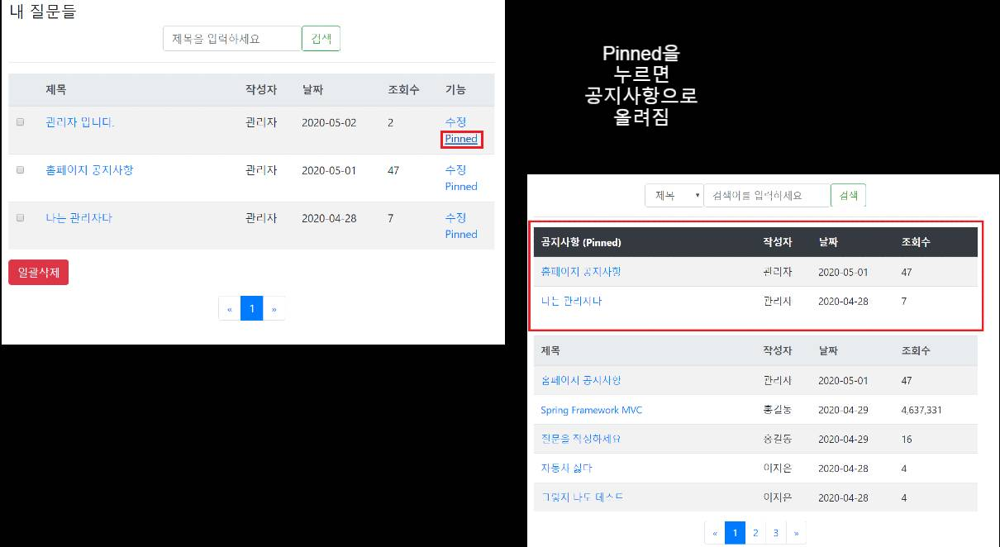

# Spring_MVC_QNA

## 개요
Spring Framework를 사용하여 Q&A 게시판 및 로그인 기능 구현

## 기술
* Spring Framework 5.2.5
* Spring Security 5.2.3 [BCrypt Encode]
* Thymeleaf 3.0.11
* JUnit 4
* Oracle XE 18c
* MyBatis 3.5.4
* Bootstrap 4.4.1
* CK Editor 4.14.0

## 기능
* 공통
    * 모든 페이지 별 세션 체크 및 이용자 ROLE 체크
    * Input 값 유효성 체크[Back-End, Front-End(HTML5 Attribute)]
    * Interceptor 적용[Login, Role]
    * DB 테이블 간 외래키 설정[종속 삭제 허용] 예) 사용자 삭제 = 작성했던 질문, 댓글, 좋아요 전부 같이 삭제
* 게시판
    * 검색[제목, 작성자]
    * 게시판 페이징
    * 작성[위지위그 CK Editor], 조회[조회수 증가], 수정, 삭제[일괄삭제]
    * 관리자 페이지[Pinned기능 - 공지사항으로 등록 ** 아래 부록 참고]
    * 내가 쓴 글
    * 좋아요, 댓글 기능
* 회원가입
    * 이메일 중복 체크[Ajax]
    * 비밀번호 암호화[BCrypt]
* 로그인
    * 비밀번호 암호화[BCrypt]
    * 세션 타이머 값 지정
    * 로그아웃[세션 파괴]
* 에러 페이지
    * 커스텀 404 및 자바 예외처리 에러 페이지
* JUnit 4
    * 테스트 케이스[현재 진행 중]
    
## 데모
링크 -> https://www.youtube.com/watch?v=_PIhtKGZJoQ
    
## 부록
* **Pinned 기능**

